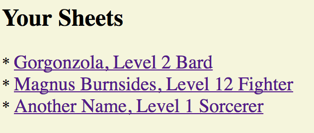
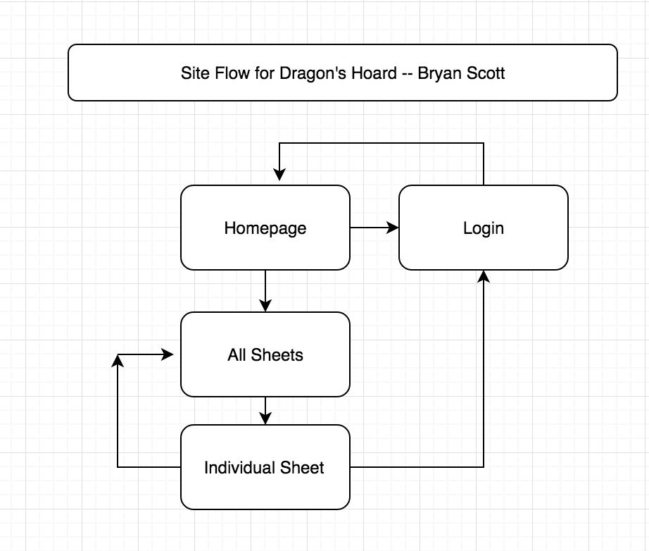

# Dragon's Hoard
A web app for storing character sheet information for Dungeons and
Dragons.

## Overview

My friends and I all play a lot of dungeons and dragons, but there are
very few good ways to manage character sheets, particularly for Fifth
Edition, the most recent edition of D&D. Other websites have either
lacking functionality, terrible style, or have problems with data
management (resulting in data rollbacks, losing out on work) so I will
be trying to create an alternative.

Once a user logs in, they can access their various character sheets,
which will be stored as individual documents. With their character
sheets obtained, they will be able to modify on the fly any particular
area of their sheet, and save them with the click of a button.

## Data Model

The application will store Users, a list of Character Sheets, and for
each character sheet, a multitude of statistics and descriptions.
* users can have multiple character sheets (via references)
* each list will have multiple items (by embedding)

(___TODO__: sample documents_)

An Example User:

```javascript
{
  username: "dreamer1",
  hash: // a password hash,
  sheets: // an array of references to Character Sheet documents
}
```

An Example Character Sheet with Embedded Properties:

```javascript
{
    user: , // a reference to a User object, the owner of the sheet
    name: "Grungo the Hairy",
    class: "Barbarian",
    level: 6,
    experience: 35000,
    background: "Mercenary Veteran",
    player: "Steven",
    faction: "The High Rollers",
    race: "Goliath",
    subrace: "",
    alignment: "True Neutral",


    traits: {
        ideological: {
            personality: "A very angry man!",
            ideals: "Punching!",
            bonds: "His fellow punchers!",
            flaws: "Hurt his hand from punching too much!",
            backstory: "He's a very strong boy who really got mad one day and hasn\'t stopped getting mad since."
        },
        personal {
            gender: "male",
            age: "40 years",
            height: "8\' 6\"",
            weight: "breaks the scale",
            eyes: "brown",
            skin: "gray",
            hair: "brown",
            image: "", // a url to an image of the character, optional

        }
    },

    abilityscores: {
        strength: 20,
        dexterity: 14,
        constitution: 16,
        intelligence: 6,
        wisdom: 10,
        charisma: 10
    },
    saves: [
        "Strength", "Constitution"
    ],
    skills: [
        {skill: "Athletics", type: "Expert"},
        {skill: "Acrobatics", type: "Proficient"},
        {skill: "Intimidation", type: "Expert"}
    ],
    hitpoints: 98,
    currenthp: 85,
    inspiration: 1,

    proficiencies: {
        language: ["Common"],
        weapon: ["Simple", "Martial"],
        armor: ["Light", "Medium", "Heavy", "Shields"],
        tool: ["Thieves Tools"],
    },

    feats: [
        {name: "Two-Weapon Fighting", description: "Allows for the use of multiple weapons in a single attack"}
        // and some more! Pretend with me.
    ],

    weapons: [
        {   name: "Greatsword of Legend",
            bonus: 10,
            damage: "2d6+8",
            type: "Greatsword",
            description: "a great sword"
        },
        {   name: "club",
            bonus: 7,
            damage: "1d8+5",
            type: "Club",
            description: "just a club"
        }
    ],
    armor: [
        {   name: "aegis of parthlezul",
            type: "Heavy",
            stealthpenalty: -2,
            baseac: 14,
            dexteritybonus: 2,
            magicalbonus: 2,
            armorclass: 18,
            description: "a very fancy vest"
            equipped: true
        },
        {   name: "leather armor",
            type: "Light",
            stealthpenalty: 0,
            baseac: 12,
            dexteritybonus: 2,
            magicalbonus: 0,
            armorclass: 14,
            description: "a noticably less fancy vest"
            equipped: false
        }
    ],
    shields: [
        {   name: "Iron Shield",
            type: "Shield",
            basebonus: 2,
            magicalbonus: 0,
            armorbonus: 2,
            description: "might just be a pot lid?"
            equipped: false
        }
    ],

    inventory: ["Some bones", "A really big stick", "An unmailed love letter"],

    magic: {
        caster: false,
        spellcastingability: "",
        spellsavedc: 0,
        spellattackbonus: 0,

        spells: {
            level0: {slots: 0, expended: 0, spells: []},
            level1: {slots: 0, expended: 0, spells: []},
            level2: {slots: 0, expended: 0, spells: []},
            level3: {slots: 0, expended: 0, spells: []},
            level4: {slots: 0, expended: 0, spells: []},
            level5: {slots: 0, expended: 0, spells: []},
            level6: {slots: 0, expended: 0, spells: []},
            level7: {slots: 0, expended: 0, spells: []},
            level8: {slots: 0, expended: 0, spells: []},
            level9: {slots: 0, expended: 0, spells: []}
        },
    }

    createdAt: ""// timestamp
}
```


## [Link to Commented First Draft Schema](db.js) 

## Wireframes

(___TODO__: wireframes for all of the pages on your site; they can be as simple as photos of drawings or you can use a tool like Balsamiq, Omnigraffle, etc._)

/sheets - page for showing all character sheets. Will probably be very
 minimalistic.



/sheet/slug - page for showing specific character sheet. The example I
have provided and will be trying to emulate is the freely-available
official D&D Character Sheet, as published by Wizards of the Coast.


## Site map



## User Stories or Use Cases

1. As non-registered user, I can register a new account with the site.
2. As any type of user, I can log in to the site.
3. As any type of user, I can view a character sheet someone has created
    and linked to me, but not edit it.
4. As a registered user, I can create a new character sheet.
5. As a registered user, I can view all of the character sheets I've
    created in a single list.
6. As a registered user, I can modify or delete my existing character
    sheets at any time.

## Research Topics

* (3 Points) Firebase Database API
    * Instead of MongoDB, I would like to use the cloud-storage based
        **Firebase Database** as it will facilitate constant real-time
        use of the app without being a strain on a computer I personally
        own. In addition, should I decide to pursue this later, Firebase
        Database is integrated in both Android and iOS platforms, so
        users could sign in on one account and see their sheets both on
        the computer and on their phones or tablets.
* (5 points) Integrate User Authentication
    * I'm going to be using **FirebaseUI** for user authentication, as
        it is a relatively easy and very flexible authentication process
        that does not require additional account creation from the user,
        letting them sign in with Google/Facebook/Twitter/Email/Github
        accounts. It also will work well with my database choice.
    * I'm not exactly sure how to score this since it's both integrating
        user authentication and utilizing an external library to do so,
        but I'll assume only five points since I'm also already using
        another library for my database. However, it is worth noting
        that while the libraries share many dependencies in the main
        Firebase API, the libraries are separate.
    * A dummy account will be made for testing; I'll email you the email
        and password if need be.
* I'm open to other ideas, but have none at the moment.

**8 points total out of 8 required points**


## [Link to Initial Main Project File](app.js)

## Annotations / References Used
1. [Firebase Database Web Tutorial](https://firebase.google.com/docs/database/)
2. [FirebaseUI Authentication Tutorial](https://github.com/firebase/firebaseui-web)
